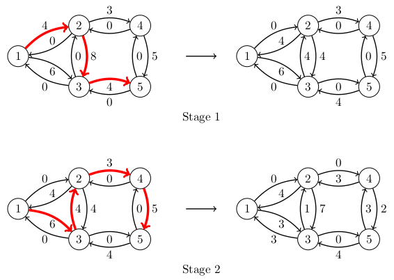

# 16. Maximum flow

In this chapter, we take a look at the problem of finding a _flow_ from a _source_ node to a _sink_ node in a directed graph. Each edge in the graph has a _capacity_ that tells how much flow the edge can carry.

The flow must be constructed so that the total flow leaving the source node is the same as the total flow going into the sink node, and for every other node the incoming flow is the same as the outgoing flow. The flow through an edge cannot exceed the capacity of the edge.

A _maximum flow_ of a graph is a flow with the largest possible total flow leaving the source. The following figure shows an example of a maximum flow from the node $$1$$ to the node $$5$$.


Here the notation $$x/c$$ means that $$c$$ is the edge capacity of which $$x$$ is used by the flow. For example, the capacity of the edge $$1 \rightarrow 2$$ is $$4$$, all of which is in use, and the capacity of the edge $$1 \rightarrow 3$$ is $$6$$ and its flow is $$3$$.

For this graph, the maximum flow value is $$7$$, which is both the outgoing flow of the node $$1$$ and the incoming flow of the node $$5$$. For the node $$2$$, for example, both the incoming flow and the outgoing flow are $$4$$.

## Ford-Fulkerson algorithm

One way to construct a maximum flow is the Ford-Fulkerson algorithm. It modifies the graph by adding edges so that every edge has a reverse edge that connects the same pair of nodes in the opposite direction. Initially, all the added edges have the capacity $$0$$. The modified version of the example graph looks like this:


The algorithm starts with a zero flow and then increases the flow in stages. In each stage, the algorithm chooses a path from the source node to the sink node, called an _augmenting path_, and increases the flow along the path.

Every edge on the augmenting path must have a positive capacity. The flow along the path will be increased by $$x$$, where $$x$$ is the smallest capacity of an edge on the path. Then, for each edge on the path, the algorithm reduces the capacity of the edge by $$x$$ and increases the capacity of the reverse edge by $$x$$. The modified capacities are called _residual capacities_ and represent the capacity available to later augmenting paths.

The algorithm keeps increasing the flow by finding augmenting paths until no path with positive residual capacities can be found. The final flow constructed by the algorithm is a maximum flow.

A maximum flow in the example graph can be constructed in two stages as follows:



In the first stage, the algorithm chooses the augmenting path $$1 \rightarrow 2 \rightarrow 3 \rightarrow 5$$. Since the smallest capacity on the path is $$4$$, the flow is increased by $$4$$. The capacity of every edge on the path is reduced by $$4$$, and the capacities of the reverse edges along the path are increased by $$4$$.

In the second stage, the augmenting path is $$1 \rightarrow 3 \rightarrow 2 \rightarrow 4 \rightarrow 5$$ with the minimum residual capacity of $$3$$. Thus the flow inreases by $$3$$, and the residual capacities along the path are updated accordingly.

Notice that the second augmenting path includes the edge $$3 \rightarrow 2$$, which was not on the original graph. Using this edge became possible when the edge gained a positive residual capacity in the first stage. Increasing the flow through such a reverse edge corresponds to reducing the flow through the original edge, i.e., the second stage cancels a part of the flow that the first stage added for the edge $$2 \rightarrow 3$$.

After the two stages, the graph has no augmenting path with a positive minimum capacity. Thus a maximum flow has been found and the algorithm ends. In this case, the maximum flow value is $$4+3=7$$.

### Implementing the algorithm

The Ford-Fulkerson algorithm can be implemented as follows:

```python
class MaximumFlow:
    def __init__(self, nodes):
        self.nodes = nodes
        self.graph = {}
        for i in self.nodes:
            for j in self.nodes:
                self.graph[(i, j)] = 0

    def add_edge(self, node_a, node_b, capacity):
        self.graph[(node_a, node_b)] += capacity

    def add_flow(self, node, sink, flow):
        if node in self.seen:
            return 0
        self.seen.add(node)
        if node == sink:
            return flow
        for next_node in self.nodes:
            if self.flow[(node, next_node)] > 0:
                new_flow = min(flow, self.flow[(node, next_node)])
                inc = self.add_flow(next_node, sink, new_flow)
                if inc > 0:
                    self.flow[(node, next_node)] -= inc
                    self.flow[(next_node, node)] += inc
                    return inc
        return 0

    def construct(self, source, sink):
        self.flow = self.graph.copy()
        total = 0
        while True:
            self.seen = set()
            add = self.add_flow(source, sink, float("inf"))
            if add == 0:
                break
            total += add
        return total
```

This implementation uses a matrix (the dictionary `graph`) that stores the capacity of every possible edge. Initially, all capacities are $$0$$. This way there is no need to add the reverse edges later.

The method `construct` computes a maximum flow and returns its value. The method `add_flow` performs a depth-first search to find a path to the sink node. After the path is found, i.e., the search reaches the sink, the method updates the capacities along the path, and returns the value of the augmenting flow.

The algorithm can be used as follows:

```python
m = MaximumFlow([1, 2, 3, 4, 5])

m.add_edge(1, 2, 4)
m.add_edge(1, 3, 6)
m.add_edge(2, 3, 8)
m.add_edge(2, 4, 3)
m.add_edge(3, 5, 4)
m.add_edge(4, 5, 5)

print(m.construct(1, 5)) # 7
```

## Minimum cut

The Ford-Fulkerson algorithm is a greedy algorithm that finds augmenting paths until there is none. How do we know that the resulting flow is a maximum flow?

To understand the algorithm, it is useful to consider another problem. A _cut_ of a graph is a set of edges such that removing them leaves no path from the source to the sink. A _minimum cut_ is a cut with the smallest total capacity.

The following figure shows a minimum cut of the example graph cutting off all routes from the node $$1$$ to the node $$5$$:


In this case, the minimum cut includes the edges $$2 \rightarrow 4$$ and $$3 \rightarrow 5$$ of total capacity $$3+4=7$$. After removing these edges from the graph, there is no path the source node $$1$$ to the sink node $$5$$.

Both the maximum flow and the minimum cut of the example graph have the value $$7$$. This is no coincidence: the maximum flow and the minimum cut always have the same value. Thus the two problems are related, and we can use this to justify the correctness of the Ford-Fulkerson algorithm.

Any cut separates the source and the sink into different components. Any flow from the source component to the sink component must go through the cut edges and its value cannot exceed the sum of their capacities. Thus all flows are smaller than or equal to all cuts.

On the other hand, for any final flow computed by the Ford-Fulkerson algorithm, we can construct a cut of equal value. This can be done by finding all nodes that can be reached from the source using edges of positive residual capacity. The sink is not among those nodes, otherwise there would be a positive augmenting path. For the example graph, these nodes are highlighted in the following figure:


Any edge going from those nodes to the other nodes must have a residual capacity $$0$$. This means that the flow is using the full original capacity of those edges, and the sum of those capacities is the value of the flow. On the other hand, those edges form a cut since they separate the source from the sink.

Thus for any flow computed by the Ford-Fulkerson algorithm, there is a cut of equal value. Since no flow can have a higher value, it must be a maximum flow. Similarly, the cut must be a minimum cut.

## Example: Prison escape

{: .note-title }
Task
<div class="note" markdown="1">

A city has intersections and streets connecting intersections. The city contains a prison and a port, both located at an intersection.

Kaaleppi has escaped the prison and tries to reach the port. The police wants to prevent this by closing streets so that there is no route from the prison to the port. What is the smallest number of streets that needs to be closed?

</div>

We can solve this task the constructing a graph with intersections as nodes and streets as edges, all of capacity $$1$$. The source node is the prison and the sink node is the port. The minimum cut of this graph tells the police which streets to close.

We can extend the task by associating each street with a level of disruption caused by closing the street. The goal of the police is now to minimize the total disruption. The solution can handle this change by using the levels of disruption as edge weights.

## Choosing augmenting paths

The efficiency of the Ford-Fulkerson algorithm depends on how the augmenting paths are chosen. Since each augmenting path increases the flow by at least $$1$$, the number of stages is at most $$f$$, where $$f$$ is the value of the maximum flow.

One augmenting path can be constructed in $$O(m)$$ time, where $$m$$ is the number of edges. Thus the time complexity of the algorithm is $$O(mf)$$.

There are cases, where the algorithm may actually increase the flow by only $$1$$ in each stage, leading to a large number of stages. The following figure shows an example of such a case:


Here the capacity $$Z$$ is some big number. The algorithm might end up alternating between the augmenting paths $$1 \rightarrow 2 \rightarrow 3 \rightarrow 4$$ and $$1 \rightarrow 3 \rightarrow 2 \rightarrow 4$$. Choosing one path changes the residual capacities between the nodes $$2$$ and $$3$$ so that the other path is enabled. Then each stage increases the flow by $$1$$, and since the maximum flow is $$2Z$$, the algorithm performs $$2Z$$ stages, which is slow.

A more efficient algorithm can be obtained by always choosing an augmenting path with the smallest number of edges. This can be achieved by using a breadth-first search instead of a depth-first search to find the augmenting path. The resulting algorithm is known as the Edmonds-Karp algorithm. The algorithm can be shown to perform no more than $$O(nm)$$ stages and thus the time complexity is $$O(nm^2)$$.

In the above graph, the Edmonds-Karp algorithm needs just two stages: first it chooses the path $$1 \rightarrow 2 \rightarrow 4$$ and then the path $$1 \rightarrow 3 \rightarrow 4$$. Each stage increases the flow by $$Z$$.

## Maximum matching

Let us consider an undirected graph that is _bipartite_, which means that the nodes of the graph can be divided into two groups so that every edge in the graph connects two nodes in different groups.

A maximum matching of the graph is a maximum set of edges such that every node belongs to at most one edge in the set. The following figure shows an example of a maximum matching of a bipartite graph:


Here the two groups of nodes are $$\{1,2,3,4\}$$ and $$\{5,6,7\}$$. The maximum matching size is $$3$$ and one possible choice for the edges is $$1-6$$, $$3-5$$ and $$4-7$$.

A maximum matching of a bipartite graph can be computed using a maximum flow in a modified graph constructed as follows:


The idea is to make the graph directed, and add a source node and a sink node. The source node has an edge to every node in the first group, and every node in the second group has an edge to the sink node. Additionally, all original edges are directed from the first group to the second group. All edge capacities are $$1$$.

The maximum flow of this graph has the same value as the maximum matching in the original graph. This is because each augmenting path goes through one of the original edges, and uses all the capacities of the added edges on the path so that no other augmenting path can contain either of the original nodes on the path.

## Example: Ball

{: .note-title }
Task
<div class="note" markdown="1">

A ball is participated by $$n$$ students from the Kumpula Campus and $$n$$ students from the Viikki Campus. Each dancing pair has one student from Kumpula and one from Viikki. 

Each student has submitted a list of students from the other campus that are acceptable partners. Your task is to find the largest possible set of dancing pairs that satisfies the lists of all students.

</div>

The task can be solved by constructing a graph with students as nodes. Two students are connected by an edge if they are from different campuses and both list the other as an acceptable partner. The graph is bipartite, since no two students from the same campus can form a dancing pair.

The solution is given by a maximum matching in the graph, which can be computed using a maximum flow algorithm in a graph modified by adding a source and a sink node and the appropriate edges.
