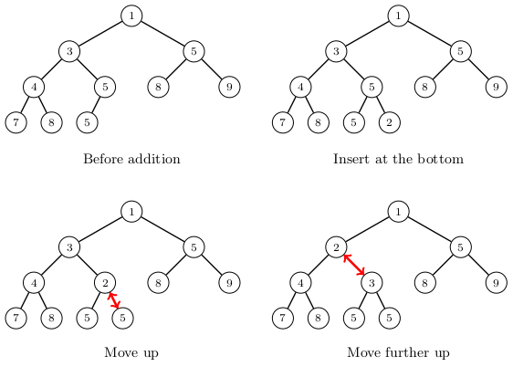
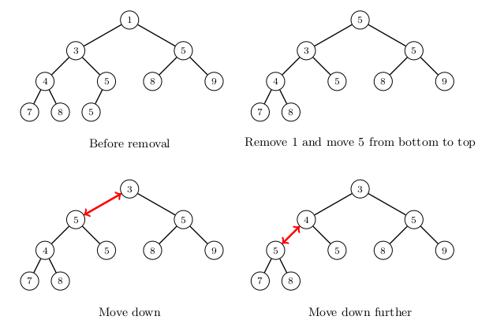

# Heap

_Heap_ is a data structure that supports the operations: (1) add a new element, (2) find the smallest/largest element, and (3) remove the smallest/largest element.

If the heap is a _min heap_, the operations (2) and (3) find and remove the smallest element. On the other hand, in a _max heap_, the operations (2) and (3) find and remove the largest element.

The heap is usually implement as a _binary heap_, which is based on the tree structure _binary tree_. Each binary tree node can have a left child and a right child. In a heap, all the levels of the tree are full, i.e, contain as many elements as possible, except the deepest level, where the elements are as far to the left as possible.

In a min heap, the element in a node is larger than or equal to the element in the parent of the node. In a max heap, the element in a node is smaller than or equal to the element in the parent node. This ensures that the element in the root node is the smallest/largest element in the heap.

## Example

The following min heap contains the elements $$[1,3,4,5,5,5,7,8,8,9]$$:


The contents of a heap can be stored as a list that contains the elements level by level starting from the top. For example, the above heap is stored as the list $$[1,3,5,4,5,8,9,7,8,5]$$. If an element is at the position $$k$$ in the list, its left child is at the position $$2k+1$$, its right child is at the position $$2k+2$$, and its parent is at the position $$\lfloor (k-1)/2 \rfloor$$. As an example, consider the element $$3$$ at the position $$1$$. Its children are at the positions $$3$$ and $$4$$ and its parent is at the position $$0$$.

## Adding an element

A new element is initially inserted at the end of the list which corresponds to the bottom of the heap. Then the element is lifted up in the heap level by level until it is at the correct position. In each step, the element is swapped with its parent.

The following picture shows how the element $$2$$ is added to the example heap. It is first inserted at the bottom and then lifted up two levels.



The time complexity of an addition is $$O(\log n)$$, because each step moves one level up and the heap has $$O(\log n)$$ levels.

## Removing an element

When the element at the root of a heap is removed, the root is first filled by moving the last element of the heap to the root. Then the element is moved down level by level until it is in its correct place in the heap.

The following picture shows how the element $$1$$ is removed from the heap. It is first replaced by the element $$5$$, which is then moved down.



Removing an element takes $$O(\log n)$$ time, because each step moves one level down and the heap has $$O(\log n)$$ levels.

## Heap as a list

In Python, inspecting a heap is easy, since the contents are stored in a list. The following code shows how the list changes as elements are added and removed as in the above examples.

```python
import heapq

heap = [1, 3, 5, 4, 5, 8, 9, 7, 8, 5]

heapq.heappush(heap, 2)
print(heap) # [1, 2, 5, 4, 3, 8, 9, 7, 8, 5, 5]

heap = [1, 3, 5, 4, 5, 8, 9, 7, 8, 5]

heapq.heappop(heap)
print(heap) # [3, 4, 5, 5, 5, 8, 9, 7, 8]
```

The module `heapq` also provides a function `heapify` that turns an existing list into a heap:

```python
import heapq

items = [8, 7, 6, 5, 4, 3, 2, 1]

heapq.heapify(items)
print(items) # [1, 4, 2, 5, 8, 3, 6, 7]
```

The time complexity of the function `heapify` is $$O(n)$$, which makes it more efficient than inserting $$n$$ elements separately into an initially empty heap. Inserting the elements one by one would take $$O(n \log n)$$ time, because the time complexity of the function `heappush` is $$O(\log n)$$.
